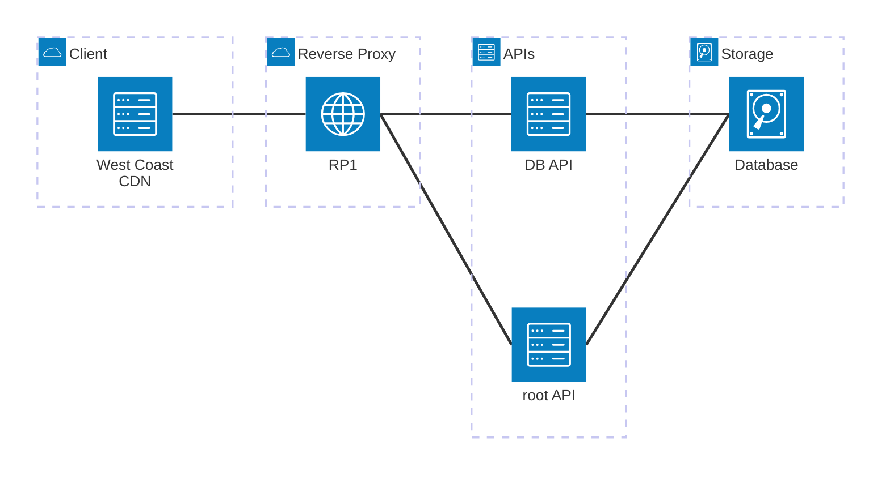
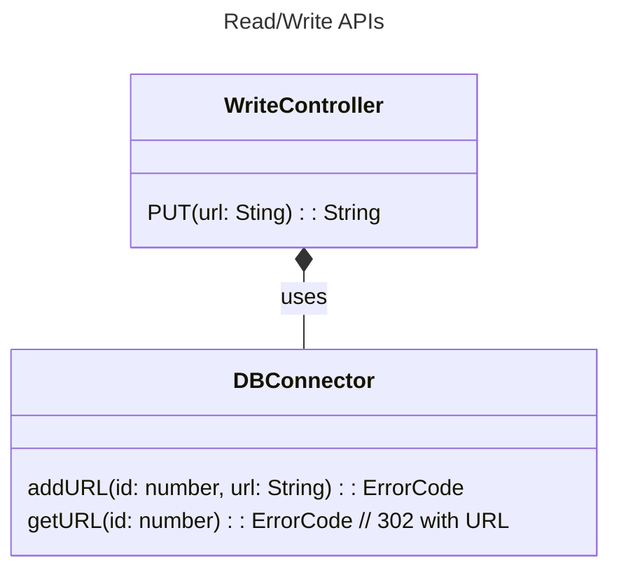
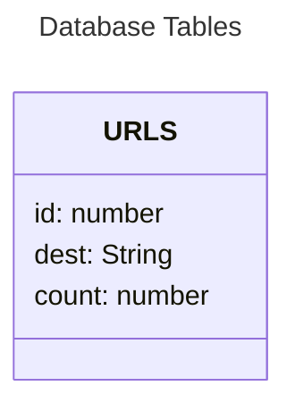

# solid-guide
URL shortening app

## Layers
Design for first iteration for the system

* **Reverse Proxy**.  Will route '/' requests o `root API`, otherwise will route to a `read API` node.
* **Root API**. Serves a client front end for adding a new url.
* **DB API**. Returns a 302 redirect to the appropriate url from SQL, otherwise to root api, with error message.
* **Database**. Stores shortcuts.

## Read API

## Data Model

