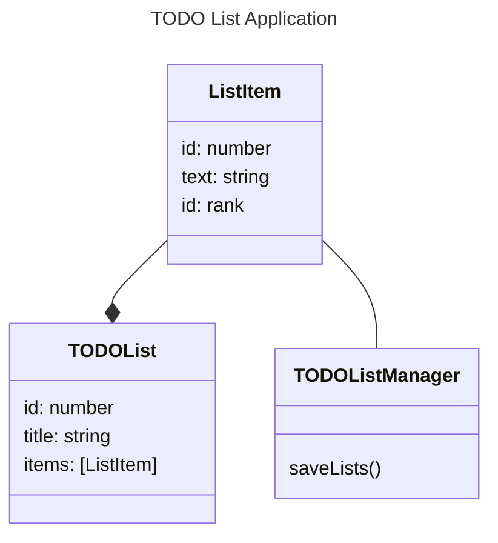

# This is a "Solid" TODO app
All for the sake of practice
## Requiremnts
* Add todo item
* Check off items
* Drag items 
* Persist items in localstorage

## Some diagrams

```mermaid
---
title: TODO List Application
---
classDiagram
  class ListItem {
      id: number
      text: string
      id: rank
  }

  class TODOList {
    id: number
    title: string
    items: [ListItem]
  }

  class TODOListManager {
    saveLists()
  }

ListItem--*TODOList
ListItem--TODOListManager

```

