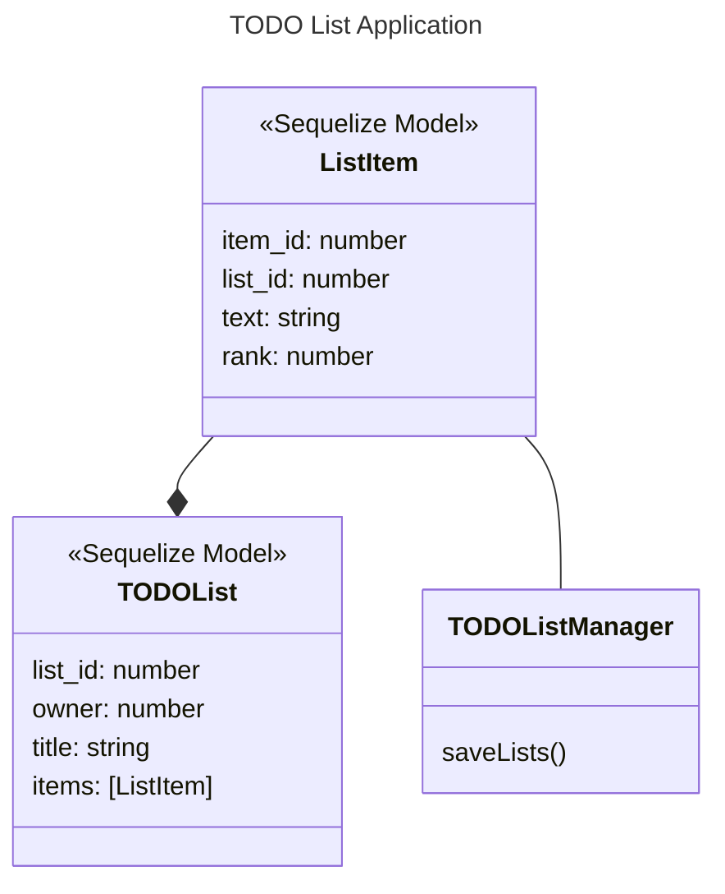

# This is a "Solid" TODO app
All for the sake of practice
## What it does
* Add todo item
* Check off items
* Drag items 
* Persist items in database via sequelize

## Some diagrams

Initially, this application was going to be front-end only, but things happen, and now there's a back end piece.

# TODO
* [ ] Add button to create multiple notes
* [ ] Add user management
* [ ] Make note title editable
* [ ] Add [federation](https://webpack.js.org/plugins/module-federation-plugin/) to later integrate with host app
* [ ] 
* [ ] 
