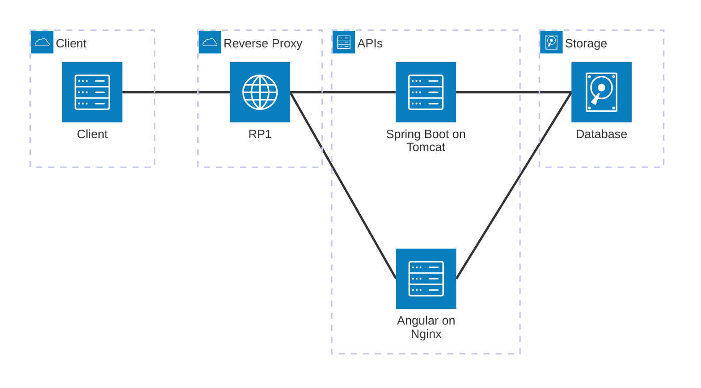
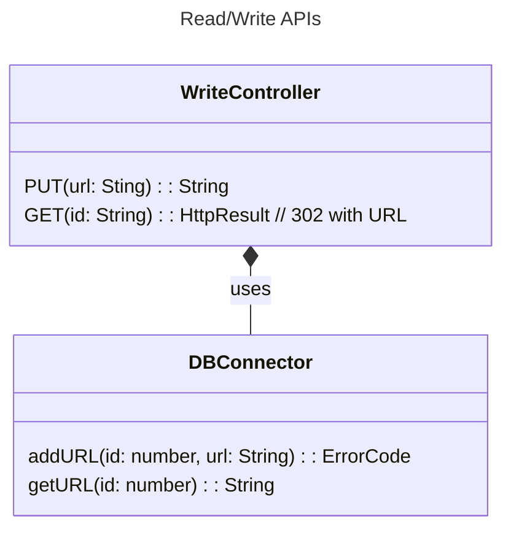
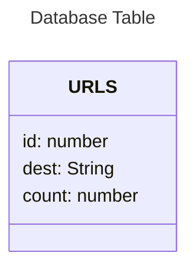

# solid-urls
URL shortening app

## Requirements

1. Users can add a url and get a shortened version of the url in the form: `   `[base-url]/[id]` where id is the value that is used on the database
1. When a shortened url is requested, the server redirects to the long url previously entered.
1. If a shortened url doesn't have a long version associated with it, the user is redirected to the (angular) page to add a new url, with an error in it's querystring

## Layers
Design for first iteration for the system

* **Reverse Proxy**.  Will route '/' requests o `Angular on Nginx`, otherwise will route to a `read API` node in Sprint Boot.
* **Angular on Nginx**. Serves a client front end for adding a new url.
* **Read API**. Returns a 302 redirect to the appropriate url from SQL, otherwise to root api, with error message.
* **Database**. Stores shortcuts in a simple id -> url table

## Read API

## Data Model

