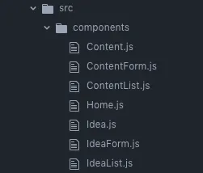
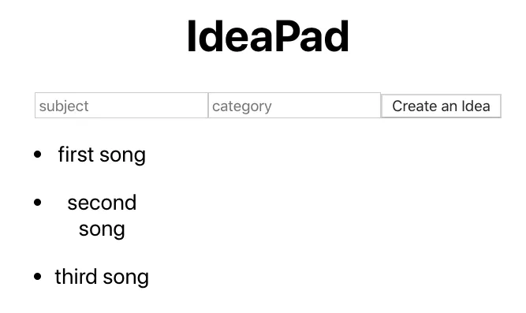
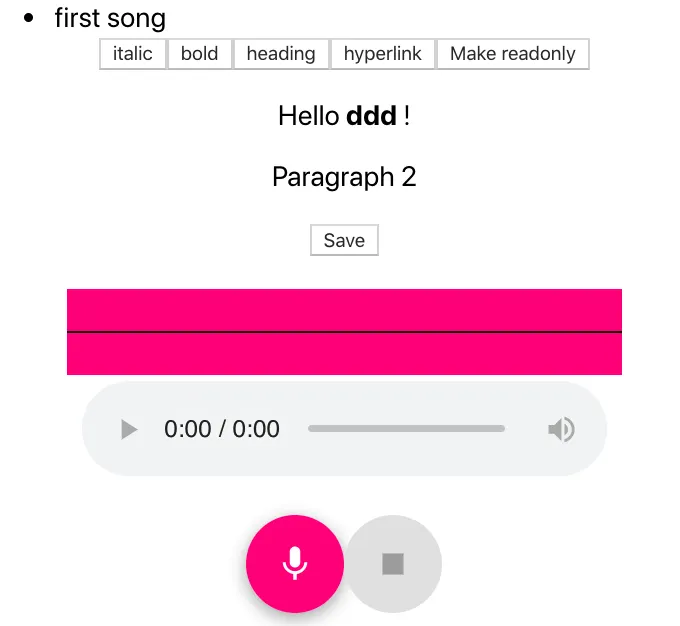
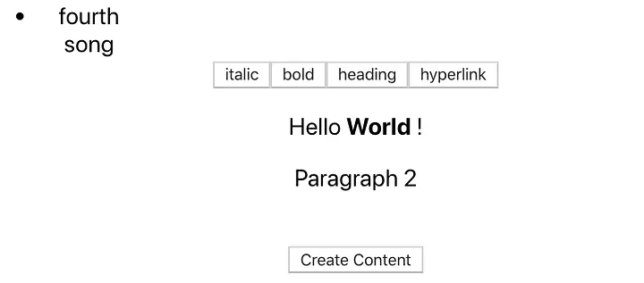
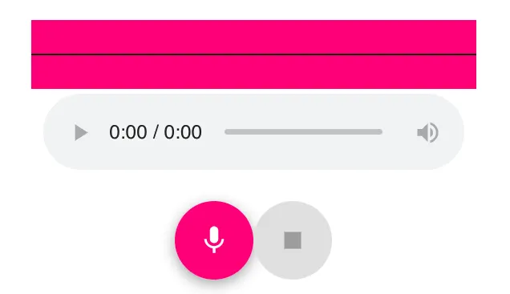

# Node, Express, Sequelize, PostgreSQL, and React App Part 1 — Backend

This blog post will show you my process for creating an app using Node, Express, Sequelize, PostgreSQL, and React. Part 1 is going to focus on the backend using Node, Express, Sequelize, and PostgreSQL. This is the first time that I have used any of these languages for a backend. I will document the basics for getting the backend set up.

I am creating an app called IdeaPad that will help you keep track of any creative ideas that you have. For all of you Mac users out there, it is like combining Notes and Voice Memos together into one convenient app. For example, this will be perfect for songwriters that write lyrics and record demos of the songs that they are working on. Each individual idea will have a space to write notes and record voice memos.

Let's get started on the backend!
---------------------------------
```
Models\
  Ideas table\
    subject:string\
    category:string

  Contents table\
    idea_id:integer\
    post:string\
    audio:stringAssociations\
  Ideas has many Contents\
  Content belongs to Idea
```

IdeaPad will be a simple app for only one user. I only need the `Ideas` and `Contents` tables with a One-To-Many Association to accomplish this. Each `Idea` will have many `Contents` that will consist of either posts or audio files.

You can follow this guide if you need help installing anything or you want more examples and explanations for what you are trying to make:

[The comprehensive step by step tutorial on Node, Express, Sequelize, and PostgreSQL model association example](https://www.djamware.com/post/5bb1f05280aca74669894417/node-express-sequelize-and-postgresql-association-example?source=post_page-----fba13fe02f69---------------------------------------)


## Sequelize Commands
```bash
sequelize-cli model:generate --name Idea --attributes subject:string,category:string
sequelize-cli model:generate --name Content --attributes idea_id:integer,content:string,audio:string
```

## Sequelize Models

```js
// models/idea.js
'use strict';
module.exports = (sequelize, DataTypes) => {
  const Content = sequelize.define('Content', {
    idea_id: DataTypes.INTEGER,
    post: DataTypes.STRING,
    audio: DataTypes.STRING
  }, {});
  Content.associate = function(models) {
    Content.belongsTo(models.Idea, {
      foreignKey: 'idea_id'
    });
  };
  return Content;
};

// models/content.js
'use strict';
module.exports = (sequelize, DataTypes) => {
  const Content = sequelize.define('Content', {
    idea_id: DataTypes.INTEGER,
    post: DataTypes.STRING,
    audio: DataTypes.STRING
  }, {});
  Content.associate = function(models) {
    Content.belongsTo(models.Idea, {
      as: 'idea',
      foreignKey: 'idea_id'
    });
  };
  return Content;
}
```

## Node Express Controllers

```js
//controllers/idea.js
const Idea = require('../models').Idea;
const Content = require('../models').Content;

module.exports = {
  list(req, res) {
    return Idea
      .findAll({
        include: [{
          model: Content,
          as: 'contents'
        }],
      })
      .then((companies) => res.status(200).send(companies))
      .catch((error) => { res.status(400).send(error); });
  },
  getById(req, res) {
    return Idea
              .findByPk(req.params.id, {
                include: [{
                  model: Content,
                  as: 'contents'
                }],
              })
              .then((company) => {
                if (!company) {
                  return res.status(404).send({
                    message: 'Idea Not Found',
                  });
                }
                return res.status(200).send(company);
              })
              .catch((error) => res.status(400).send(error));
  },
  add(req, res) {
    return Idea
          .create({
            subject: req.body.subject,
            category: req.body.category,
          })
          .then((company) => res.status(201).send(company))
          .catch((error) => res.status(400).send(error));
  },
  addWithContents(req, res) {
    return Idea
          .create({
            subject: req.body.subject,
            category: req.body.category,
            contents: req.body.contents,
          }, {
              include: [{
              model: Content,
              as: 'contents'
            }]
          })
          .then((company) => res.status(201).send(company))
          .catch((error) => res.status(400).send(error));
  },
  update(req, res) {
    console.log(req.body);
    return Idea
      .findById(req.params.id, {
        include: [{
          model: Content,
          as: 'contents'
        }],
      })
      .then(company => {
        if (!company) {
          return res.status(404).send({
            message: 'Idea Not Found',
          });
        }
        return company
          .updateAttributes({
            subject: req.body.subject || company.subject,
            category: req.body.category || company.category,
            contents: req.body.contents || company.contents,
          }, {
              include: [{
              model: Content,
              as: 'contents'
            }]
          })
          .then(() => res.status(200).send(company))
          .catch((error) => {console.log(error);res.status(400).send(error);});
      })
      .catch((error) => {console.log(error);res.status(400).send(error);});
  },
  delete(req, res) {
    return Idea
      .findByPk(req.params.id)
      .then(company => {
        if (!company) {
          return res.status(400).send({
            message: 'Idea Not Found',
          });
        }
        return company
          .destroy()
          .then(() => res.status(204).send())
          .catch((error) => res.status(400).send(error));
      })
      .catch((error) => res.status(400).send(error));
  },
};

//controllers/content.js
// 
const Content = require('../models').Content;
const Idea = require('../models').Idea;

module.exports = {
  list(req, res) {
    return Content
      .findAll({
        include: [{
          model: Idea,
          as: 'idea'
        }],
      })
      .then((contents) => res.status(200).send(contents))
      .catch((error) => { res.status(400).send(error); });
  },
  getById(req, res) {
    return Content
      .findByPkv(req.params.id, {
        include: [{
          model: Idea,
          as: 'idea'
        }],
      })
      .then((content) => {
        if (!content) {
          return res.status(404).send({
            message: 'Content Not Found',
          });
        }
        return res.status(200).send(content);
      })
      .catch((error) => res.status(400).send(error));
  },
  add(req, res) {
    return Content
      .create({
        idea_id: req.body.idea_id,
        post: req.body.post,
        audio: req.body.audio,
      })
      .then((content) => res.status(201).send(content))
      .catch((error) => res.status(400).send(error));
  },
  update(req, res) {
    return Content
      .findById(req.params.id, {
        include: [{
          model: Idea,
          as: 'idea'
        }],
      })
      .then(content => {
        if (!content) {
          return res.status(404).send({
            message: 'Content Not Found',
          });
        }
        return content
          .update({
            post: req.body.post || idea.post,
            audio: req.body.audio || idea.audio,
          })
          .then(() => res.status(200).send(content))
          .catch((error) => res.status(400).send(error));
      })
      .catch((error) => res.status(400).send(error));
  },
  delete(req, res) {
    return Content
      .findByPk(req.params.id)
      .then(content => {
        if (!content) {
          return res.status(400).send({
            message: 'Content Not Found',
          });
        }
        return content
          .destroy()
          .then(() => res.status(204).send())
          .catch((error) => res.status(400).send(error));
      })
      .catch((error) => res.status(400).send(error));
  },
};

//controllers/index.js
const idea = require('./idea');
const content = require('./content');

module.exports = {
  idea,
  content,
};

```

## Node Express Routes

```js
// routes/index.js
var express = require('express');
var router = express.Router();const ideaController = require('../controllers').idea;
const contentController = require('../controllers').content;/* GET home page. */
router.get('/', function(req, res, next) {
  res.render('index', { title: 'Express' });
});/* Company Router */
router.get('/api/idea', ideaController.list);
router.get('/api/idea/:id', ideaController.getById);
router.post('/api/idea', ideaController.add);
router.put('/api/idea/:id', ideaController.update);
router.delete('/api/idea/:id', ideaController.delete);/* Branch Router */
router.get('/api/content', contentController.list);
router.get('/api/content/:id', contentController.getById);
router.post('/api/content', contentController.add);
router.put('/api/content/:id', contentController.update);
router.delete('/api/content/:id', contentController.delete);/* Advance Router */
router.post('/api/idea/add_with_contents', ideaController.addWithContents);module.exports = router;

```

## Wrapping Up

Finally, we can migrate these changes with:
```bash
sequelize db:migrate
```

Start the server up with:
```bash
npm run start
```

Check if it works by going to <http://localhost:3000/api/idea> and <http://localhost:3000/api/content> in your browser.

Now we have a backend up and running!

Part 2 will be seeding the backend and creating React frontend.

Thanks for reading!


# Part 2

## It's getting seedy...

The Sequelize commands for setting up the seed files:

```bash
sequelize seed:create --name my-seed-file
```

### Ideas Seed
```js
'use strict';
module.exports = {
  up: (queryInterface, Sequelize) => {
    return queryInterface.bulkInsert('Ideas', [{
      subject : 'First song',
      category : 'Music',
      createdAt : new Date(),
      updatedAt : new Date()
    }], {});
  },
  down: (queryInterface, Sequelize) => {
    queryInterface.bulkDelete('Ideas', [{
      subject :'First song'
    }])
  }
};
```
### Contents Seed

```js
'use strict';
module.exports = {
  up: (queryInterface, Sequelize) => {
    return queryInterface.bulkInsert('Contents', [{
      idea_id : 1,
      post : 'Great lyrics',
      audio : 'sounds',
      createdAt : new Date(),
      updatedAt : new Date()
    }], {});
  },
  down: (queryInterface, Sequelize) => {
    queryInterface.bulkDelete('Contents', [{
      post :'Great lyrics'
    }])
  }
};
```

Run the seed command like this:

```bash
sequelize db:seed:all
```

You can check the tables to see if it seeded correctly like so:

```sql
psql ideaSELECT * FROM "Ideas";\
SELECT * FROM "Contents";
```

## React

I assume that most of the people reading this blog post are already familiar with how to code in React, so I will discuss my approach for creating this IdeaPad app and highlight interesting things that I learned along the way.


The final result. Pretty, I know. Styling and more features will be in future installments.



### Component Hierarchy

What we have so far is the basic skeleton of this app that posts Ideas and Contents for each Idea. An Idea can be posted with the IdeaForm. Each Idea consists of a subject and a category (not currently displayed, but will be there in the future along with a filter by category feature). When an Idea is clicked, it will display the Contents under that idea. Each Content consists of a post textarea field and an audio input field (currently just a string, but will be an audio file that can be uploaded or recorded). There is also a ContentForm that lets you post more Contents to each idea.

One of the interesting errors that I got while fetching Ideas from the backend was the No CORS Error. The fix for this was quite simple:

```js
postIdea = (idea) => {
    fetch(`/api/idea/`, {
      method: "POST",
      mode: "cors",
      cache: "no-cache",
      credentials: "same-origin",
      headers: {
          "Content-Type": "application/json; charset=utf-8",
      },
      redirect: "follow",
      referrer: "no-referrer",
      body: JSON.stringify(idea)
    })
    .then(r => r.json())
    .then(r => {
      this.fetchIdeas()
    })
  }
``` 

You can see that when you are fetching from a Node/Express backend, you don't need to include localhost:3000 or whatever port you are using when you fetch.

See you in the next installment!

### Sources
<https://gist.github.com/vapurrmaid/a111bf3fc0224751cb2f76532aac2465>

# Part 3

This week I added React-ContentEditable and React-Mic to my project, as well as changing the structure of my Content components. Here is what we have so far:


Home page


Content page

Ideas can be created and there are CreateContent or EditContent forms that appear when an idea is clicked. Audio is recorded and the wavelengths of the audio are displayed with the black line in the pink rectangle. Audio can be saved to the computer.

React-ContentEditable
---------------------




React-ContentEditable form

The React-ContentEditable form is a React component for a div with editable contents. Whatever is typed into the form is posting a text string and its HTML to the Contents table.

I added an html column with this Sequelize command:

sequelize migration:create --name add_html_to_contents

The migration looks like this:

'use strict';module.exports = {\
  up: (queryInterface, Sequelize) => {\
    return queryInterface.addColumn(\
      'Contents',\
      'html',\
     Sequelize.STRING\
    );\
  },down: (queryInterface, Sequelize) => {\
    return queryInterface.removeColumn(\
      'Contents',\
      'html'\
    );\
  }\
};

Make sure that you add the new columns to the models and controllers as well.

sequelize db:migrate

Users can apply HTML tags to what is typed and it will be saved to the database.

import React from "react";\
import ContentEditable from "react-contenteditable";\
import sanitizeHtml from "sanitize-html";class ContentForm extends React.Component {state = {\
    idea_id: null,\
    post: '',\
    audio: '',\
    html: `<p>Hello <b>World</b> !</p><p>Paragraph 2</p>`,\
    editable: true\
  };handleChange = e => {\
    this.setState({ html: e.target.value, post: e.target.value.replace(/<[^>]+>/g, '') });\
  };sanitizeConf = {\
    allowedTags: ["b", "i", "em", "strong", "a", "p", "h1"],\
    allowedAttributes: { a: ["href"] }\
  };sanitize = () => {\
    this.setState({ html: sanitizeHtml(this.state.html, this.sanitizeConf) });\
  };handleSubmit = e => {\
    e.preventDefault();\
    this.props.postContent({\
      idea_id: this.props.idea.id,\
      post: this.state.post,\
      audio: this.state.audio,\
      html: this.state.html\
    })\
  };render() {\
    return (\
      <div className="contentForm">\
        <EditButton cmd="italic" />\
        <EditButton cmd="bold" />\
        <EditButton cmd="formatBlock" arg="h1" name="heading" />\
        <EditButton\
          cmd="createLink"\
          arg="<https://github.com/lovasoa/react-contenteditable>"\
          name="hyperlink"\
        />\
        <form onSubmit={this.handleSubmit} action="">\
          <div>\
            <ContentEditable\
              className="editable"\
              html={this.state.html} // innerHTML of the editable div\
              disabled={!this.state.editable} // use true to disable edition\
              onChange={this.handleChange} // handle innerHTML change\
              onBlur={this.sanitize}\
              value={this.state.post}\
            />\
            <br/>\
            <button type="submit">\
              Create Content\
            </button>\
          </div>\
        </form>\
      </div>\
    )\
  }\
}function EditButton(props) {\
  return (\
    <button\
      key={props.cmd}\
      onMouseDown={evt => {\
        evt.preventDefault(); // Avoids losing focus from the editable area\
        document.execCommand(props.cmd, false, props.arg); // Send the command to the browser\
      }}\
    >\
      {props.name || props.cmd}\
    </button>\
  );\
}export default ContentForm

I used Markup from the Interweave component to display the HTML in the correct format in the Content component.

import React from "react";\
import { Markup } from 'interweave';\
import Audio from './Audio.js';class Content extends React.Component {render() {\
    return (\
      <div className="content">\
        <Markup content={this.props.content.html} />\
        <Audio />\
      </div>\
    )\
  }\
}\
export default Content

React-Mic
---------


React-Mic

React-Mic is component that lets users record audio from their computer and save it to their computer. I used MaterialUI to create the buttons for starting and stopping the recording. The audio is saved as WebM audio file format on your computer and is a BLOB in React. A Binary Large OBject (BLOB) is a collection of binary data stored as a single entity in a database management system. I will discuss how to store this in a future installment.

import React, {Component}          from 'react';\
import { render }                  from 'react-dom';\
import { FloatingActionButton,\
        MuiThemeProvider }         from 'material-ui';\
import MicrophoneOn                from 'material-ui/svg-icons/av/mic';\
import MicrophoneOff               from 'material-ui/svg-icons/av/stop';import { ReactMic, saveRecording } from 'react-mic';\
import ReactGA                     from 'react-ga';ReactGA.initialize('UA-98862819-1');class Audio extends React.Component {\
  constructor(props){\
    super(props);\
    this.state = {\
      blobObject: null,\
      isRecording: false\
    }\
  }componentDidMount() {\
    ReactGA.pageview(window.location.pathname);\
  }startRecording= () => {\
    this.setState({\
      isRecording: true\
    });\
  }stopRecording= () => {\
    this.setState({\
      isRecording: false\
    });\
  }onSave=(blobObject) => {\
  }onStart=() => {\
    console.log('You can tap into the onStart callback');\
  }onStop= (blobObject) => {\
    this.setState({\
      blobURL : blobObject.blobURL\
    });\
  }onData(recordedBlob){\
    console.log('chunk of real-time data is: ', recordedBlob);\
  }render() {\
    const { isRecording } = this.state;return(\
      <MuiThemeProvider>\
        <div>\
          <ReactMic\
            className="oscilloscope"\
            record={isRecording}\
            backgroundColor="#FF4081"\
            visualSetting="sinewave"\
            audioBitsPerSecond= {128000}\
            onStop={this.onStop}\
            onStart={this.onStart}\
            onSave={this.onSave}\
            onData={this.onData}\
            strokeColor="#000000" />\
          <div>\
            <audio ref="audioSource" controls="controls" src={this.state.blobURL}></audio>\
          </div>\
          <br />\
          <FloatingActionButton\
            className="btn"\
            secondary={true}\
            disabled={isRecording}\
            onClick={this.startRecording}>\
            <MicrophoneOn />\
          </FloatingActionButton>\
          <FloatingActionButton\
            className="btn"\
            secondary={true}\
            disabled={!isRecording}\
            onClick={this.stopRecording}>\
            <MicrophoneOff />\
          </FloatingActionButton>\
        </div>\
    </MuiThemeProvider>\
    );\
  }\
}export default Audio

See you in the next part!


# LARC Notes

